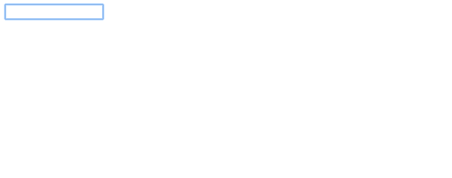

# Clockmap

A small lib to create a nice looking clock display the hour and the map of the city of your choice



## Use it

**Configuration**

```
default: {
  name: "Home" // display the name on top of the clock
  container: ".clockmap", // the container the clock will be add to
  location: "New York", // plein text location
  coordinates: null, // optional
  size: 100 // Dimension of your clock
}
```

**Setting up**

` npm install clockmap `

```
var myHomeClock = new ClockMap({
  location: "New York",
  container: '.myclock',
  size: 200
});
```

## Contribute

* Install it

`$ npm i`

* Run it

`$ npm run start`

* Build it

`$ npm run build`

* Watch it

`$ npm run watch`

## Sources and inspirations

* Iulian Anghel (http://codepen.io/iulianghel/)
* Cssanimation (https://cssanimation.rocks/clocks/)