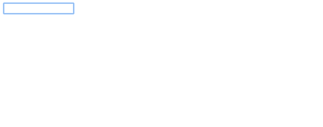

<h1 align="center">
  Clockmap
  <br>
</h1>

<h4 align="center">Nice looking clock displaying the hour and the map of the city of your choice</h4>

<p align="center">
  <a href="#demo">Demo</a> •
  <a href="#installation">Installation</a> •
  <a href="#contribute">Contribute</a> •
  <a href="#references">References</a> •
  <a href="#license">License</a> •
  <a href="#authors">Authors</a>
</p>

## Demo



## Installation

**Configuration**

```
default: {
  name: "Home" // display the name on top of the clock
  container: ".clockmap", // the container the clock will be add to
  location: "New York", // plein text location
  coordinates: null, // optional
  size: 100 // Dimension of your clock
}
```

**Setting up**

` npm install clockmap `

```
var myHomeClock = new ClockMap({
  location: "New York",
  container: '.myclock',
  size: 200
});
```

## Contribute

* Install it

`$ npm i`

* Run it

`$ npm run start`

* Build it

`$ npm run build`

* Watch it

`$ npm run watch`

## References

* Iulian Anghel (http://codepen.io/iulianghel/)
* Cssanimation (https://cssanimation.rocks/clocks/)

## License

Distributed under the MIT license.

## Authors

[Julien Rougeron](https://github.com/julienr2) – [Portoflio](https://julienr2.github.io) – julien.rougeron@gmail.com
